# Babble — 영어 발음 연습 플랫폼

> 1인 풀스택 프로젝트 | 설계 · 개발 · 배포 · 운영 전 과정을 직접 수행

스크립트를 읽고 AI가 발음을 분석해주는 서비스. 모바일 앱에서 녹음하면 BullMQ를 통해 AI 서비스로 전달되고, 분석 결과가 SSE로 실시간 전송된다. Mac Mini 위에서 Docker Compose + Cloudflare Tunnel로 실제 운영 중이다.

| 서비스 | 기술 | 공개 |
|--------|------|:----:|
| **app-backend** | TypeScript, Express 5, TypeORM, tsyringe, BullMQ | 핵심 모듈만 공개 |
| **app-admin** | Next.js 16, React 19, TypeScript | X |
| **app-infrastructure** | Docker Compose, Nginx, PostgreSQL 15, Redis 7 | X |
| **app-mobile** | Flutter 3.3+, Dart, Provider | X |
| **app-ai** | Python 3.12, Redis Worker, faster-whisper | X |

> **소스 코드 공개 범위**: 백엔드의 핵심 설계를 보여주는 4개 모듈(auth, assessment, gamification, user)과 공통 아키텍처(shared)만 공개합니다. 나머지 모듈과 서비스는 보안 및 운영상의 이유로 비공개입니다.

---

## 앱 스크린샷

### 온보딩

<p align="center">
  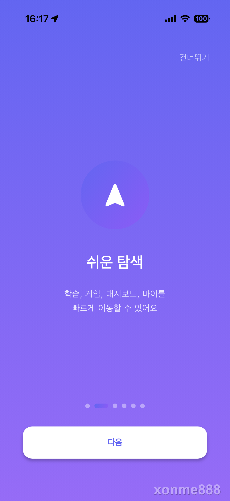
  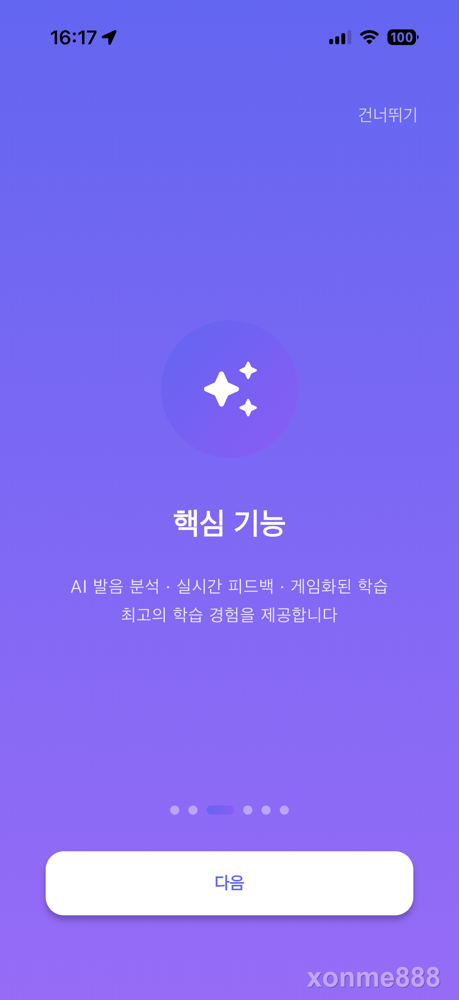
  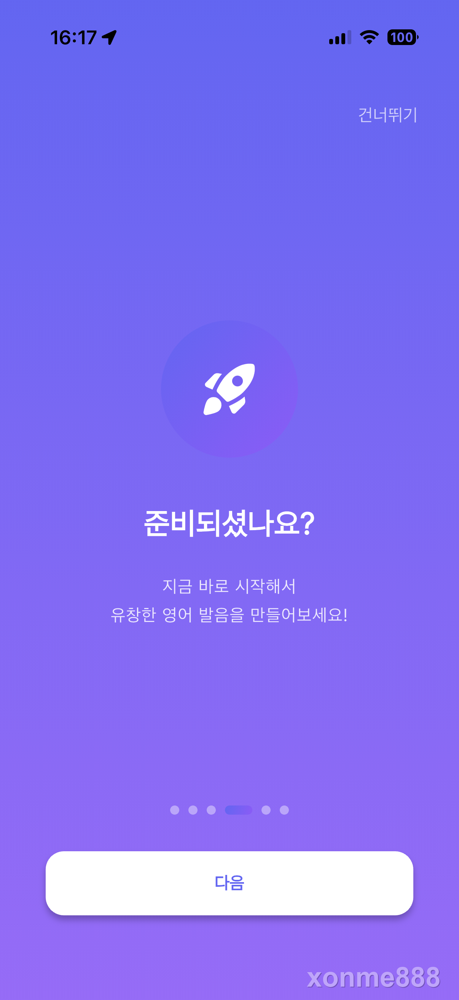
</p>

앱 첫 실행 시 온보딩 화면. 학습·게임·대시보드·마이 탭의 쉬운 탐색, AI 발음 분석·실시간 피드백·게임화된 학습 등 핵심 기능을 소개한다.

### 초기 설정

<p align="center">
  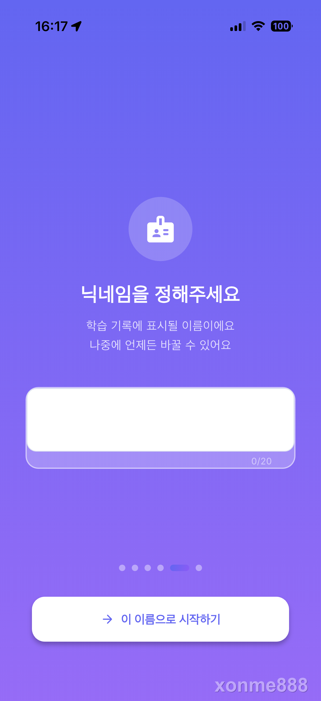
  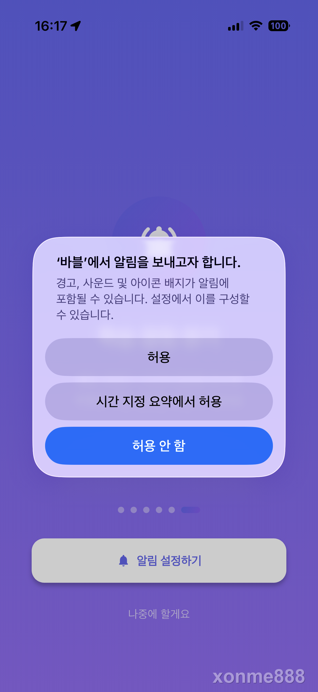
</p>

닉네임 설정(학습 기록에 표시될 이름, 20자 제한)과 푸시 알림 권한 요청. 닉네임은 나중에 변경 가능하고, 알림은 학습 리마인더 등에 사용된다.

### 메인 화면

<p align="center">
  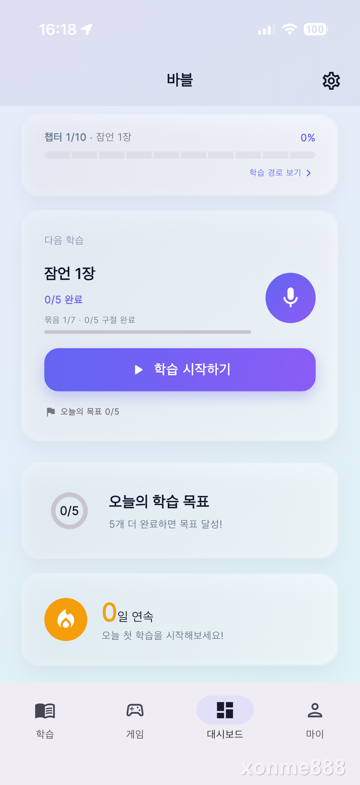
  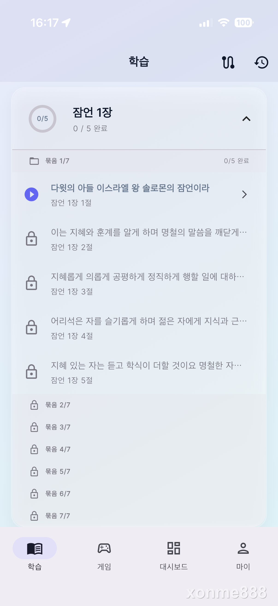
</p>

**대시보드** — 챕터 진도율, 다음 학습 스크립트, 오늘의 학습 목표(5개), 연속 학습일(스트릭)을 한눈에 보여준다. **학습 탭** — 잠언 1장의 구절 목록. 챕터→묶음(5개 단위)→구절 순서로 순차 해금되며, 완료한 묶음만 다음이 열린다.

### 발음 연습

<p align="center">
  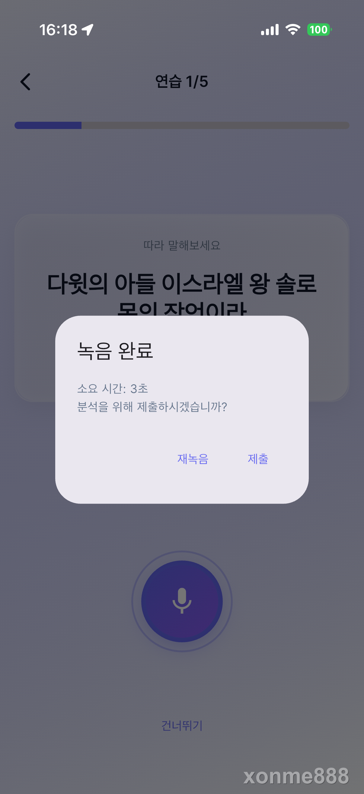
</p>

스크립트를 따라 읽고 녹음하면 AI가 발음을 분석한다. 녹음 완료 후 소요 시간이 표시되고, 재녹음 또는 제출을 선택할 수 있다. 음성은 BullMQ를 통해 AI 서비스(Redis Worker + faster-whisper)로 전달되고, 분석 결과가 SSE로 실시간 전송된다.

### 학습 결과

<p align="center">
  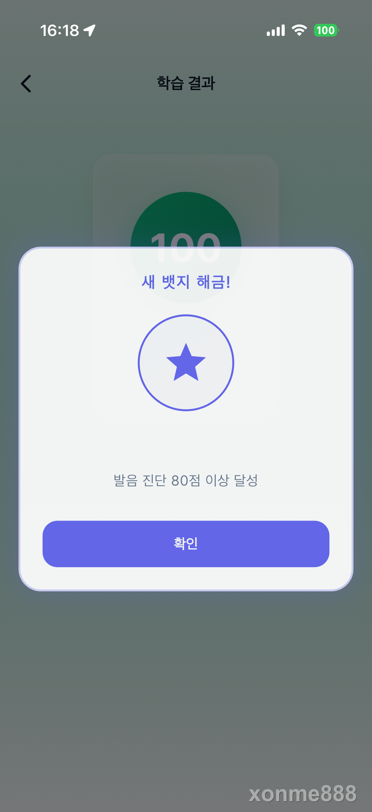
  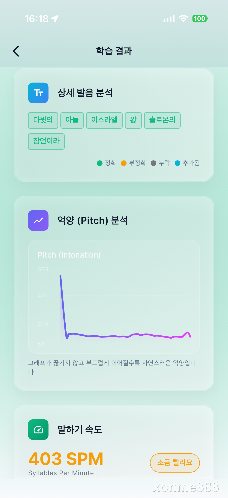
  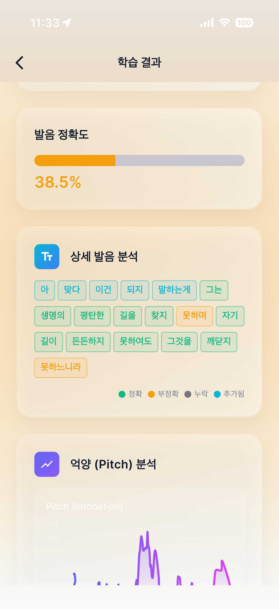
</p>

**뱃지 해금** — 발음 진단 80점 이상 달성 시 뱃지가 해금된다. 15개 뱃지가 DB에 정의되어 있고, 조건 충족 시 Domain Event로 자동 수여된다. **상세 분석** — 단어별 정확/부정확/누락/추가 판정, 유창성 분석, 음성 품질, 억양(Pitch) 그래프, 말하기 속도(SPM), 단조로움/더듬음 감지 등 다차원 AI 분석 결과를 시각적으로 제공한다.

---

### 기술적 하이라이트

| 영역 | 내용 |
|------|------|
| **아키텍처** | 헥사고날 아키텍처 + Port 기반 DI (38개 인터페이스) + Domain Event 부수효과 분리 |
| **DB 스키마** | 도메인 접두사(`asm_`, `gmf_`) + SnakeNamingStrategy 자동 컬럼 매핑 |
| **인증** | JWT 이중 토큰 + Token Rotation + 10초 Grace Period + 치료사-환자 접근 제어 |
| **AI 분석** | 발음 정확도 + 유창성(fluency) + 음성 품질(voiceQuality) + 단조로움(monotone) + 더듬음(stuttering) |
| **비동기 처리** | BullMQ 큐 → AI Worker (4종: SCRIPT/WORD/BREATHING/FREE_SPEECH) → SSE 실시간 전송 |
| **게스트 체험** | deviceId 기반 익명 계정 → 회원 전환 시 학습 데이터 병합 (`/auth/merge-guest`) |
| **데이터 무결성** | 분산 락(토큰 갱신), UPSERT(중복 생성 방지), 낙관적 잠금(`@SafeVersionColumn`) |
| **인프라** | 3-tier 네트워크 격리, 무중단 롤링 배포, Prometheus + Loki + Grafana 모니터링 |
| **테스트** | Unit / Integration / E2E 3단계 테스트 + OpenAPI 계약 검증 (61개 테스트 파일) |

---

## 시스템 아키텍처

### 전체 흐름

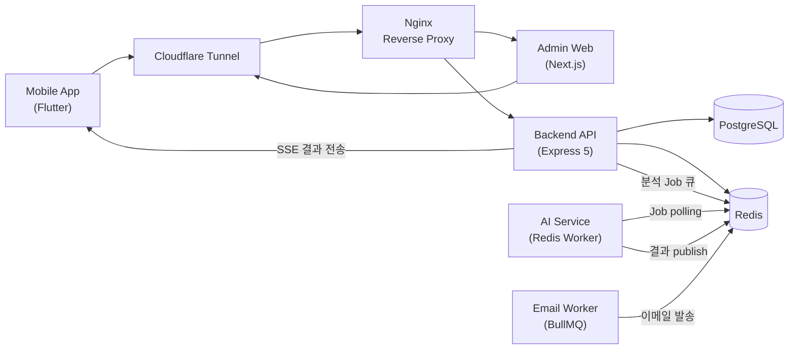

### Backend 내부 (Clean Architecture)

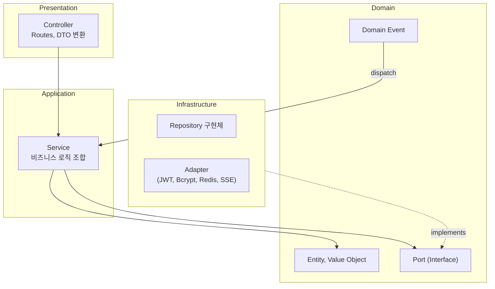

**핵심 규칙**: 의존성은 항상 안쪽으로. 피처 간 의존은 반드시 Port 인터페이스(38개)를 거치고, tsyringe가 런타임에 구현체를 주입한다. Domain Event로 핵심 로직과 부수 효과(XP, 뱃지, 학습 기록)를 분리했다. DB 컬럼은 SnakeNamingStrategy로 자동 매핑되고, 도메인별 테이블 접두사(`asm_`, `gmf_`)로 네임스페이스를 분리한다.

### 인프라 구조 (Docker Compose)

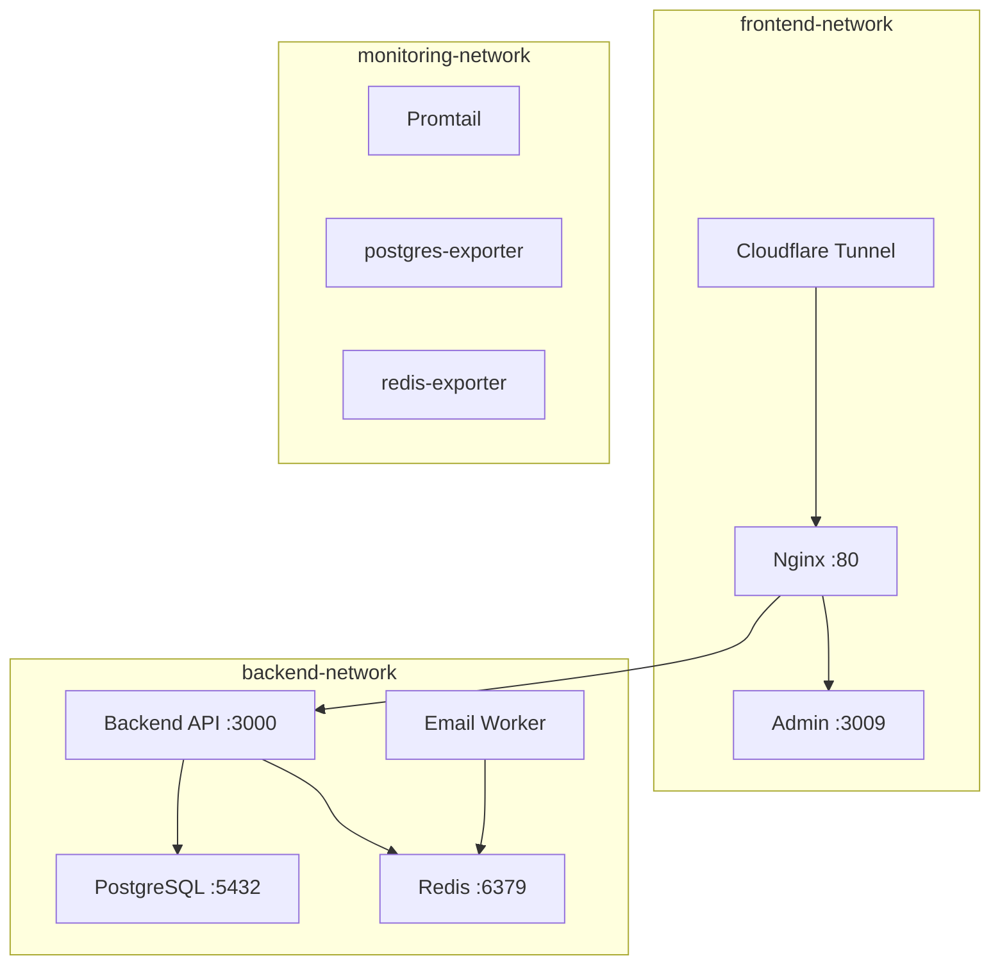

네트워크를 3개로 분리했다. 외부에서 접근 가능한 건 Cloudflare Tunnel → Nginx뿐이고, PostgreSQL/Redis는 backend-network 안에서만 접근된다. Mac Mini에서 운영 중이고, Cloudflare Tunnel로 인바운드 포트 개방 없이 HTTPS를 제공한다.

---

## 기술 스택

| 영역 | 기술 | 선택 이유 |
|------|------|-----------|
| Runtime | Node.js 20, TypeScript | 타입 안전성 + 프론트/백 언어 통일 |
| Framework | Express 5 | 미들웨어 생태계, async error 자동 처리 (v5) |
| ORM | TypeORM | 데코레이터 기반 엔티티, SnakeNamingStrategy, Migration 지원 |
| DI | tsyringe | 데코레이터 기반 경량 DI, NestJS 없이 Clean Architecture 구현 |
| Queue | BullMQ + Redis | AI 분석 비동기 처리, 재시도/DLQ/Job 상태 관리 |
| Auth | jsonwebtoken + bcryptjs | JWT 이중 토큰, 패스워드 해싱 |
| DB | PostgreSQL 15 | JSONB (피드백 데이터), Soft Delete |
| Cache/Pub-Sub | Redis 7 | 토큰 저장, 분산 락, 스트릭 캐싱, SSE Pub/Sub, BullMQ 브로커 |
| Logging | Pino | 구조화 JSON 로그, 요청 추적 (traceId) |
| Metrics | prom-client | Prometheus 호환 메트릭 |
| Email | Nodemailer + SendGrid | 인증 메일, 비밀번호 재설정 |
| API Docs | swagger-ui-express | OpenAPI 3.0 자동 문서화 |
| Admin | Next.js 16 + React 19 | SSR, App Router, next-intl (i18n) |
| Mobile | Flutter 3.3+ | 크로스플랫폼, Provider 상태 관리 |
| AI | Redis Worker + faster-whisper | 음성 STT + 다차원 발음 분석 (정확도/유창성/음질/억양) |
| Infra | Docker Compose + Nginx | 컨테이너 오케스트레이션, 리버스 프록시 |
| Tunnel | Cloudflare Tunnel | 인바운드 포트 없이 HTTPS 서비스 |

---

## 핵심 설계 결정

### JWT 이중 토큰 — Access 15분 + Refresh 7일

Access Token은 15분으로 짧게, Refresh Token은 7일로 설정했다. 모바일과 웹 양쪽을 지원해야 해서 Refresh Token은 Cookie(웹)와 Body(모바일) 두 경로로 전달한다.

Token Rotation을 적용했고, Refresh 시 이전 토큰에 10초 grace period를 줬다. 동시에 날아오는 요청이 race condition을 일으키는 걸 방지하기 위해서다. 이전 토큰도 아닌 토큰이 들어오면 탈취로 판단하고 해당 사용자의 전체 세션을 폐기한다.

```
Token 상태 판단:
- stored와 일치 → "current" → 새 토큰 발급
- previous와 일치 + 10초 이내 → "previous" → 새 토큰 발급 (grace)
- 둘 다 불일치 → "revoked" → 전체 세션 폐기
```

### BullMQ + Redis 큐 — AI 분석 비동기 처리

발음 분석은 AI 서비스에서 3~10초 걸린다. 동기로 처리하면 API 응답이 블로킹되니까 BullMQ로 Job을 큐에 넣고 즉시 202 응답을 보낸다. BullMQ Worker가 Job을 수신하면 AnalysisType(SCRIPT/WORD/BREATHING/FREE_SPEECH)에 따라 taskType을 결정하고, Redis 리스트(`ai:tasks`)에 push한다. Python AI Worker가 BLPOP으로 task를 가져와 처리하고, 결과를 `ai:results:completed` 리스트에 push한다. Backend의 Subscriber가 BLPOP으로 결과를 수신하여 타입별로 라우팅(Assessment/VoiceDiary/Therapy)한 뒤 SSE로 클라이언트에 전송한다.

게스트 사용자는 `guest-{deviceId}` 형태의 jobId를 쓰고, Subscriber에서 skip된다(polling 방식으로 결과 확인). 일반 사용자는 `assessment-{id}-{retryCount}` 형태의 jobId를 쓴다.

실패 시 자동 재시도(delay 후 재큐잉)하고, `retryCount`가 3회에 도달하면 `MAX_RETRY_EXCEEDED` 상태로 전환된다. 처리 실패한 메시지는 Dead Letter Queue(`ai:analysis:dead-letter`)에 보존된다.

### SSE — WebSocket 대신 선택한 이유

분석 결과 알림은 서버→클라이언트 단방향이라 양방향인 WebSocket이 과하다. SSE는 HTTP 기반이라 Nginx 리버스 프록시에서 별도 설정이 거의 필요 없고, 자동 재연결도 내장돼 있다.

다만 수평 확장 시 SSE 연결이 특정 인스턴스에 묶이는 문제가 있어서 Redis Pub/Sub를 중간에 두었다. 어떤 인스턴스에 SSE가 연결돼 있든 Redis를 통해 메시지가 전달된다.

### 게스트 체험 — deviceId 기반 익명 계정 → 회원 병합

가입 장벽을 낮추기 위해 게스트로 즉시 체험할 수 있게 했다. 디바이스 ID를 기반으로 GUEST 역할의 임시 계정을 생성하고, 발음 분석을 체험할 수 있다. 게임이나 리더보드 같은 기능은 잠긴다.

회원 가입 시 게스트 계정의 Assessment 기록을 기존 계정으로 병합하는 `/auth/merge-guest` API를 만들었다. 이미 같은 이메일로 계정이 있으면 기존 계정에 병합하고 게스트 계정을 삭제한다.

모바일에서는 `GuestGate` 위젯과 `FeatureAccessPolicy` 인터페이스로 기능별 접근 제어를 구현했다. 기능별로 trial 횟수를 다르게 설정할 수 있다.

### Soft Delete — 콘텐츠 삭제가 학습 이력을 깨뜨리는 문제

Script를 삭제하면 해당 Script로 진행한 Assessment가 참조를 잃는다. `@DeleteDateColumn`으로 soft delete를 적용하고, Assessment 생성 시 Script의 title/content/difficulty를 `scriptSnapshot` 필드에 스냅샷으로 저장해서 원본이 삭제되더라도 이력을 보존한다.

Admin에서 삭제된 Script/Chapter를 복원(`/restore`)할 수 있게 했다.

### 동시성 제어 — 분산 락, UPSERT, 낙관적 잠금

세 가지 패턴을 상황에 맞게 사용한다.

**분산 락** — 토큰 갱신(`refresh`) 요청이 동시에 들어오면 Redis 락으로 직렬화한다. 5초 TTL에 3회 재시도, 실패 시 429 상태로 응답한다. Grace Period만으로는 동시 요청 2건이 동시에 새 토큰을 발급하는 걸 막지 못해서 추가했다.

**UPSERT** — UserLevel과 DailyGoalLog처럼 "없으면 생성, 있으면 갱신"하는 엔티티는 `findOne → save` 대신 `ON CONFLICT` 기반 UPSERT를 쓴다. 동시 요청이 같은 행을 동시에 생성하려는 중복 삽입을 방지한다. 챌린지 참여자 수는 `SET participantCount = participantCount + 1` 원자적 증가로 lost update를 막는다.

**낙관적 잠금** — Assessment, UserLevel 등 동시 수정 가능한 엔티티에 `@SafeVersionColumn`을 적용한다. 충돌 시 OptimisticLockException을 던진다.

---

## 도메인 모델

### 핵심 엔티티 관계

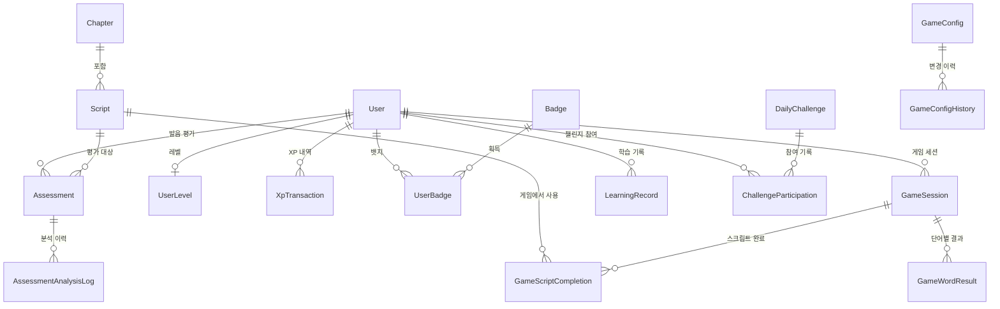

### 도메인 용어 사전

| 용어 | 정의 |
|------|------|
| **Assessment** | 사용자의 발음 평가 한 건. 음성 업로드 → AI 분석(4종 타입) → 다차원 점수/피드백. 출처(MOBILE/THERAPY/GUEST) 구분 |
| **Script** | 연습용 문장 콘텐츠. Chapter에 속하고 difficulty(EASY/MEDIUM/HARD)를 가짐 |
| **Chapter** | Script를 묶는 단위. 순서(orderIndex)가 있고 순차 해금됨 |
| **GameSession** | 단어 게임 한 판. Script의 빈칸을 채우는 방식 |
| **XpTransaction** | XP 적립/차감 한 건. source(assessment, game, dailyGoal 등)와 amount 기록 |
| **UserLevel** | 사용자의 현재 레벨과 누적 XP |
| **Badge** | 달성 조건 기반 뱃지. DB에 조건이 정의되어 있어 코드 변경 없이 추가 가능 |
| **DailyChallenge** | 매일 자동 생성되는 챌린지. 참여자끼리 점수 순위 경쟁 |
| **LearningRecord** | 일별 학습 기록. 스트릭 계산과 일일 목표 달성 추적에 사용 |
| **ContentVersion** | Script/Chapter의 콘텐츠 버전. 모바일 캐시 무효화에 사용 |

### Assessment 상태 흐름

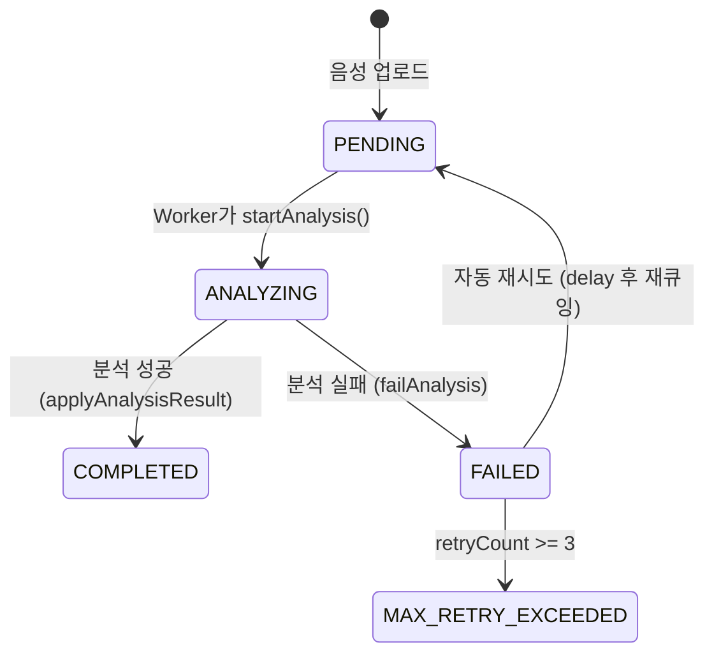

### AI 분석 확장

Assessment는 단순 발음 점수를 넘어 다차원 분석을 지원한다.

| 분석 항목 | 설명 |
|-----------|------|
| **pronunciationScore** | 전체 발음 정확도 (0~100) |
| **fluencyScore / fluencyDetail** | 유창성 점수 + 상세 분석 (말더듬, 반복, 휴지) |
| **voiceQuality** | 음성 품질 (명료도, 볼륨 안정성) |
| **monotone** | 단조로움 수치 (억양 변화 부족) |
| **stuttering** | 더듬음 감지 결과 |

**분석 유형(AnalysisType)**: SCRIPT(스크립트 따라읽기), WORD(단어 연습), BREATHING(호흡 운동), FREE_SPEECH(자유 발화)

**출처(AssessmentOrigin)**: MOBILE(일반 앱), THERAPY(치료 세션), GUEST(게스트 체험)

AI 서비스와의 경계에서 snake_case(Redis/AI) ↔ camelCase(Domain)를 `toDomainAnalysisResult()` 변환 함수로 매핑한다.

### 게스트 체험 정책

- 게스트 계정: `deviceId`로 식별, GUEST 역할 부여
- 체험 가능: 발음 분석 (trial 제한)
- 체험 불가: 단어 게임, 리더보드, 학습 이력, 프로필 설정
- 2단계 동의: 서비스 약관(1단계) → 음성 수집 동의(2단계, `voiceConsentAt`)
- 회원 전환: 게스트 데이터가 기존/신규 계정으로 병합됨

### XP/레벨 공식

**레벨업 필요 XP**: `level * 100 * (1 + (level - 1) * 0.2)`

| 레벨 | 누적 XP | 구간 XP |
|:----:|--------:|--------:|
| 1 | 0 | - |
| 2 | 240 | 240 |
| 3 | 576 | 336 |
| 5 | 1,520 | 500 |
| 10 | 6,640 | 1,000 |
| 50 | 최대 | - |

**주요 XP 보상**:

| 행동 | XP |
|------|---:|
| 발음 평가 완료 | 50 |
| 고득점 보너스 (90점+) | +25 |
| 게임 첫 클리어 | 20 |
| 게임 반복 | 5 |
| 게임 퍼펙트 (0 오답) | +10 |
| 게임 복습 보너스 (3일+) | +15 |
| 게임 세션 상한 | 60/세션 |
| 일일 목표 달성 | 20 |
| 7일 스트릭 | 50 |
| 30일 스트릭 | 200 |
| 챌린지 1위 | 100 |

---

## API 설계

기본 경로: `/api/v1`

### 모듈별 엔드포인트

| 모듈 | 메서드 | 경로 | 설명 |
|------|--------|------|------|
| **Auth** | POST | `/auth/register` | 회원가입 |
| | POST | `/auth/login` | 로그인 |
| | POST | `/auth/refresh` | 토큰 갱신 |
| | POST | `/auth/guest` | 게스트 계정 생성 |
| | POST | `/auth/guest/voice-consent` | 음성 동의 (2단계) |
| | POST | `/auth/guest/upgrade` | 게스트 → 회원 전환 |
| | POST | `/auth/merge-guest` | 게스트 데이터 병합 |
| | POST | `/auth/verify-email` | 이메일 인증 |
| | POST | `/auth/request-password-reset` | 비밀번호 재설정 요청 |
| **User** | GET | `/users/me` | 내 프로필 |
| | GET | `/users/stats` | 학습 통계 |
| | GET | `/users/achievements` | 획득 뱃지 |
| | GET | `/users/script-progress` | 스크립트별 진도 |
| | PUT | `/users/weekly-goal` | 주간 목표 변경 |
| | DELETE | `/users/withdraw` | 회원 탈퇴 |
| **Assessment** | POST | `/assessments` | 음성 업로드 + 분석 요청 (multipart) |
| | GET | `/assessments` | 평가 이력 (페이지네이션) |
| | GET | `/assessments/:id` | 평가 상세 |
| | GET | `/assessments/trial/policy` | 게스트 체험 정책 |
| | GET | `/assessments/notifications/sse` | 분석 결과 SSE 스트림 |
| **Script** | GET | `/scripts` | 스크립트 목록 (필터: 난이도, 카테고리) |
| | GET | `/scripts/chapters` | 챕터 목록 |
| | GET | `/scripts/chapters/me` | 내 챕터 + 해금/번들 진도 |
| | GET | `/scripts/next/me` | 다음 미완료 스크립트 |
| | GET | `/scripts/word-game/today` | 오늘의 단어 게임 스크립트 |
| **Game** | POST | `/game-sessions` | 게임 세션 생성 |
| | GET | `/game-sessions` | 세션 이력 |
| | GET | `/game-sessions/weak-scripts` | 취약 스크립트 분석 |
| | GET | `/challenges/today` | 오늘의 챌린지 |
| | POST | `/challenges/:id/participate` | 챌린지 참여 (1인 1회) |
| | GET | `/challenges/:id/leaderboard` | 챌린지 리더보드 |
| **Gamification** | GET | `/gamification/profile` | 레벨, XP, 스트릭, 뱃지 수 |
| | GET | `/gamification/badges` | 전체 뱃지 + 해금 상태 |
| | GET | `/gamification/leaderboard` | XP 리더보드 |
| | GET | `/gamification/rewards/pending` | 미확인 보상 (뱃지, 레벨업) |
| | POST | `/gamification/rewards/acknowledge` | 보상 확인 처리 |
| **Learning** | GET | `/learning-records/streak` | 현재/최장 스트릭 |
| | GET | `/learning-records/daily-goal` | 일일 목표 현황 |

### 발음 분석 요청 → 결과 수신 시퀀스

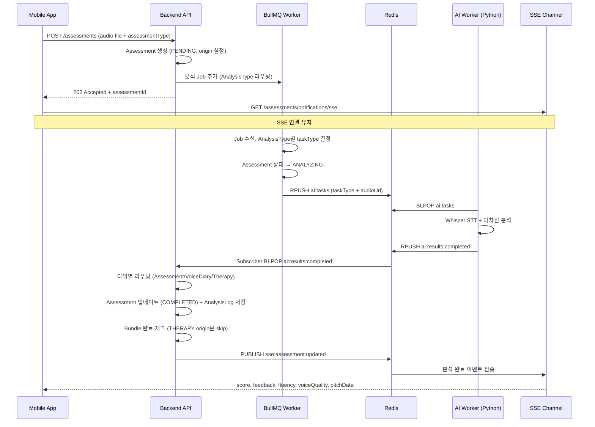

### 분석 타입별 라우팅

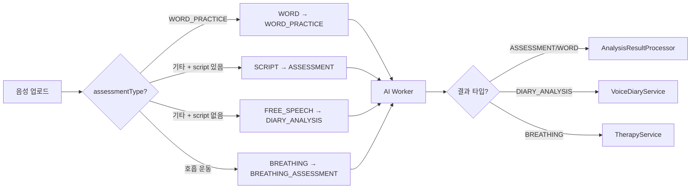

---

## 모바일 아키텍처 (비공개 요약)

비공개 저장소(`app-mobile`)의 아키텍처만 간략히 정리한다.

**패턴**: Provider + MVVM. ViewModel이 상태를 관리하고, View는 Provider를 통해 구독한다.

**게스트 접근 제어**: `FeatureAccessPolicy` 인터페이스를 정의하고, `TrialBasedPolicy`(게스트 — 기능별 trial 횟수 제한)와 `AlwaysAllowPolicy`(회원)를 구현체로 나눴다. `GuestGate` 위젯이 Presentation 레이어에서 기능 접근을 차단하고 로그인 유도 UI를 보여준다.

**네비게이션**: `go_router` + `StatefulShellRoute.indexedStack`로 5탭 구조를 구현했다. 탭 전환 시 상태가 유지된다. 전체 화면 흐름(발음 연습 세션, 피드백 상세)은 별도 라우트로 분리했다.

**챕터 해금**: 챕터는 순차 해금. 현재 챕터의 Script를 5개 단위(bundle)로 완료하면 다음 bundle이 열린다. 전체 챕터 완료 시 다음 챕터가 해금된다.

**오프라인 복원력**: API 실패 시 기존 캐시 데이터를 유지하고, `.empty()` 기본값으로 UI 크래시를 방지한다. `refresh()`에서 에러가 나도 기존 데이터를 덮어쓰지 않는다.

---

## 게임화 시스템

### 뱃지 (15개, DB 주도)

뱃지 조건은 `badge-seed.ts`에 정의되어 DB에 시딩된다. 새 뱃지 추가 시 코드 변경 없이 시드 데이터만 추가하면 된다. `BadgeConditionEvaluator`가 조건 타입(STREAK, SCORE, COUNT, LEVEL)별로 평가한다.

| 카테고리 | 뱃지 | 조건 |
|----------|------|------|
| STREAK | 꾸준한 시작 / 일주일 연속 / 2주 마라톤 / 한 달 챌린저 | 3 / 7 / 14 / 30일 연속 |
| SCORE | 우수한 발음 / 뛰어난 발음 / 완벽한 발음 | 80 / 90 / 95점 이상 |
| COUNT | 첫 걸음 / 열 번의 도전 / 반백 달성 / 백전백승 | 1 / 10 / 50 / 100회 |
| LEVEL | 레벨 5 / 10 / 20 / 50 달성 | 해당 레벨 도달 |

### Admin 설정 가능한 게임 규칙 (25개)

XP 보상, 콤보 배율, 게임 난이도, 힌트 정책 등을 Admin에서 실시간 변경할 수 있다. `GameConfig` 엔티티에 key-value로 저장하고, 변경 이력은 `GameConfigHistory`에 기록된다. 낙관적 잠금을 적용해서 동시 수정 시 충돌을 감지한다.

클라이언트는 ETag 캐싱으로 설정 변경 여부를 확인한다.

### 주간 리더보드

XP 기준으로 사용자 순위를 매긴다. 챌린지별 리더보드는 `compositeScore` 기준으로 정렬된다.

---

## 트러블슈팅

### 헥사고날 의존성 방향 위반 수정

7개의 의존성 방향 위반이 있었다. Application 레이어가 Presentation의 DTO를 import하거나, 인터페이스(Port)가 Infrastructure에 정의되어 있는 문제들이었다.

- `ILogger`, `IRedisService` → `shared/core/`로 이동
- `ClientType`, 도메인 DTO들 → 각 feature의 `domain/`으로 이동
- `IRealtimeNotifier`가 Express의 `Response`를 직접 참조 → `SSEConnection` 추상화를 도입해서 Infrastructure 의존 제거

수정 후 기존 테스트 전부 통과. 기존 코드와의 호환성은 re-export 패턴으로 유지했다.

### 대시보드 API 실패 복원력

HomeScreen에서 API 실패 시 4가지 버그가 동시에 발생했다:
1. `savedSession!` force unwrap으로 null 참조 크래시
2. API 에러를 게스트 상태로 잘못 판별 → CTA 모드 오류
3. `refresh()`에서 에러 시 기존 데이터를 null로 덮어쓰기
4. `initialize()`와 `refresh()`의 비대칭적 null 처리

해결: null guard 추가, `.empty()` 기본값 도입, 에러 시 기존 데이터 보존 전략으로 변경. 5개의 실패 시나리오 테스트를 추가했다.

### go_router 마이그레이션

Flutter 기본 Navigator에서 go_router로 마이그레이션했다. 21개 파일 수정.

핵심 변경:
- `StatefulShellRoute.indexedStack`으로 5탭 레이아웃 구현 (탭 전환 시 상태 유지)
- async gap 문제: `BuildContext` 대신 글로벌 `appRouter` 인스턴스 사용
- `RouteAware` → Provider 패턴으로 대체
- Dialog에서 Navigator와 go_router의 pop 충돌 → Dialog 전용 Navigator 사용

### 동시성 버그 3건 일괄 수정

운영 로그에서 간헐적으로 발생하는 이상 징후 3건을 추적했다:

1. **토큰 갱신 race condition** — 모바일에서 앱 재개 시 동시에 2건의 refresh 요청이 날아가면, 둘 다 현재 토큰으로 인증되어 각각 새 토큰을 발급한다. 먼저 완료된 쪽이 저장한 토큰을 나중 쪽이 덮어써서 클라이언트가 무효한 토큰을 받는다. Redis 분산 락으로 같은 사용자의 refresh를 직렬화해서 해결했다.

2. **UserLevel/DailyGoalLog 중복 생성** — 첫 XP 적립 시 `findOne → 없으면 create → save` 패턴에서, 동시 요청 2건이 모두 "없음"을 확인하고 각각 INSERT해서 unique constraint 위반이 발생했다. UPSERT(`ON CONFLICT`)로 전환했다.

3. **챌린지 참여자 수 누락** — `participantCount`를 `count + 1`로 읽고 `save`하면 동시 참여 시 한쪽이 누락된다. SQL 레벨 `SET = participantCount + 1` 원자적 증가로 교체했다.

---

## 프로젝트 구조

```
app-backend/src/
├── index.ts                    # 진입점 (DI 초기화, graceful shutdown)
├── app.ts                      # Express 앱 팩토리 (미들웨어, 라우트)
├── worker.ts                   # Email Worker 프로세스
├── features/
│   ├── auth/                   # 인증 (JWT, 게스트, 이메일 인증) ★ 공개
│   │   ├── application/        # AuthService, LoginStrategy, TokenRotation
│   │   ├── domain/             # TokenRefreshPolicy, ClientType, VerificationCode
│   │   ├── infrastructure/     # JwtTokenProvider, BcryptPasswordHasher
│   │   └── presentation/       # Routes, Guards (auth/admin/guest/voiceConsent/clientAccess)
│   ├── assessment/             # 발음 평가 (업로드, AI 분석, 결과) ★ 공개
│   │   ├── domain/             # Assessment(asm_), AI 분석 인터페이스, AnalysisLog
│   │   ├── application/        # AnalysisResultProcessor, AnalysisService
│   │   └── worker/             # BullMQ Worker (4종 분석 타입), Subscriber
│   ├── gamification/           # 게임화 (XP, 레벨, 뱃지, 설정) ★ 공개
│   │   └── domain/             # Badge, UserLevel, XpTransaction (gmf_ 접두사)
│   ├── user/                   # 사용자 (도메인 엔티티, VO, 이벤트) ★ 공개
│   │   └── domain/             # User Entity, Email/Password VO, Domain Events
│   ├── script/                 # 스크립트/챕터 (콘텐츠, 해금, 버전) — 비공개
│   ├── game/                   # 단어 게임 (세션, 챌린지, 리더보드) — 비공개
│   ├── learning/               # 학습 기록 (스트릭, 일일 목표) — 비공개
│   └── notification/           # 알림 (SSE, 이메일, BullMQ Worker) — 비공개
├── shared/
│   ├── core/                   # Port 인터페이스(38개), Base Entity, 예외, DI 토큰(39개)
│   ├── infra/                  # Config, Logger, DB(SnakeNamingStrategy), Redis, Queue, i18n
│   ├── lib/                    # Domain Event Bus, 이메일 템플릿
│   └── presentation/           # 공통 미들웨어 (에러 핸들러, traceId, rate limit)
└── scripts/                    # 시딩, OpenAPI 생성, 계약 검증
```

---

## 시작하기

### Backend 실행

```bash
cd app-backend
cp .env.example .env    # 환경변수 설정 (DB, Redis, JWT 시크릿 등)
npm install
npm run dev             # http://localhost:3000
```

### 테스트

```bash
cd app-backend
npm run test            # unit + integration + e2e
npm run lint            # ESLint
```

### API 문서

Backend 실행 후 `http://localhost:3000/api-docs` (Swagger UI, 개발 환경 전용)

---

## 공개 범위

이 저장소는 포트폴리오 열람 목적으로 **백엔드 핵심 설계 역량**을 보여주는 부분만 선별 공개합니다.

| 서비스 | 공개 | 비고 |
|--------|:----:|------|
| **app-backend** | 부분 공개 | 핵심 4개 모듈(auth, assessment, gamification, user) + shared 아키텍처 |
| app-admin | X | Next.js 16 기반 관리자 대시보드 |
| app-infrastructure | X | Docker Compose, Nginx, 모니터링 설정 |
| app-mobile | X | Flutter 3.3+ 기반, 이 README에 아키텍처 요약 포함 |
| app-ai | X | Redis BLPOP Worker + faster-whisper 기반 음성 분석 |

**공개 모듈 선정 기준**:

| 공개 모듈 | 보여주는 역량 |
|-----------|---------------|
| **auth** | JWT 이중 토큰 + Token Rotation + 분산 락, 게스트 체험 → 회원 병합, 치료사-환자 접근 제어 |
| **assessment** | BullMQ 비동기 처리(4종 분석 타입) + Redis Pub/Sub + SSE, 다차원 AI 분석(fluency/voiceQuality/monotone/stuttering) |
| **gamification** | Domain Event 기반 부수효과 분리, DB 주도 뱃지 시스템, XP/레벨 설계, 도메인 접두사(`gmf_`) |
| **user** | 도메인 엔티티, Value Object(Email, Password), 게스트→회원 전환 로직, Domain Event 발행 |
| **shared** | 헥사고날 아키텍처, Port 인터페이스(38개), SnakeNamingStrategy, Base Entity, 공통 미들웨어 |

---

## 라이선스

Copyright (c) 2025 나승후 (Seunghoo Na). All rights reserved.

이 저장소는 포트폴리오 열람 목적으로만 공개되어 있습니다. 코드의 복제, 수정, 배포, 상업적/비상업적 사용은 허가 없이 금지됩니다. 자세한 내용은 [LICENSE](./LICENSE) 파일을 참고하세요.
